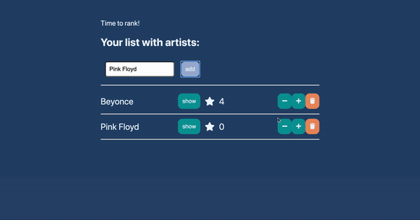

# Artist ranker
In this test we are going to build a way for you to rank your favorite artists.

# The task
The app should support the following features:

# Add artist

Provide a textfield for artist name and a button to add the artist
Validate that name is not empty
Store the artist in the application state
Artist Ranking List

 - Sort the list of artists, in the number of stars (if two artists are on the same number of stars any order will be ok - no need to write code for that)
 - For each artist, show the artist name + picture if present (this is updated from the artist  page, see below)
 - For each artist, proivde a +-button to add stars to your artist
 - For each artist, --button to remove start from your artist
 - For each artist, provide a star-count, showing the number of stars given to the list

# Artist Page

 - When clicking on the artist name, the Artist Ranking List navigate to the Artist Page
 - The user should be able to update the name
 - The user should be able to add an URL to a picture of the artist
 - A Save-button should store the information in the application state
 - Provide a route directly to the artist
 - Provide a link back to the Artist Ranking List

# Additional requirements and clarifications
* The state of the app should only be local in the browser for one user, hence no backend is needed (nor any WebSockets)
* You should use more than one component
* Keep the state in the App-component
* Make sure the application works by running npm install && npm start
* Make sure that you don't have linting or test errors left in the code
* The purpose of the test is not styling, and we leave it up to you to decide how much styling is needed to make the app useful.

# How will we evaluate this test
* We will do a functional verification of the ranking app
* We will run linting and tests that are present in the code and expected them to yield 0 errors
* We will take a look at the code and application structure and expect that you have used components, props, context and state as we have talked about during the week.

# Handing in the solution
Upload your entire solution (except node_modules) in a folder called reactArtistRanker.

